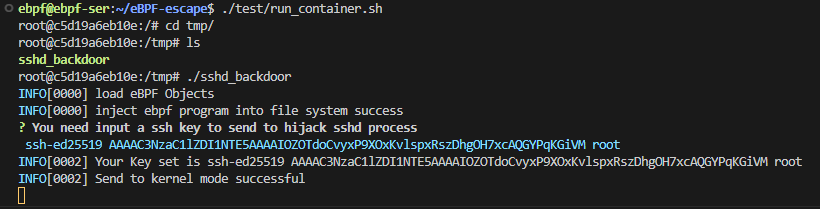

# eBPF-escape

## Fuction

使用eBPF程序插入ssh后门，具有root权限。

## Process

1. hook openat syscall,根据文件名和进程名过滤拿到sshd的pid 和打开的 fd (通过exit时的ctx→ret)
	1. 在enter时检查进程名是否为"sshd"，参数中的文件名是否为"/root/.ssh/authorized_keys"
	2. 在exit的时候存储对应的返回值fd
2. hook read syscall 根据fd和pid过滤拿到sshd读取key的buf，并通过bpf_probe_write_user修改用户空间内存中的buf
	1. 在read enter时存储buff指针参数和大小
	2. 在read exit时根据存储的fd，和在enter时拿到的存储buff指针，修改对应的buff指针尾部MAX_PAYLOAD_LEN字节长的空间。（因此需要对应目标文件有那么多空间，否则无法写入，实战中可以向对应文件写入一些空格占位）
3. hook exit syscall 清理ebpf map中保存的fd和pid，防止破坏其他进程和文件。

## Usage

### Compile

```shell
make build
```

### Run

```shell
sudo ./sshd_backdoor
```

提供默认的payload为test25519.pub，可自行修改。

### In Docker

使用启动脚本`./test/run_container.sh`，随后在容器内/tmp目录下执行`./sshd_backdoor`。



然后在另外一台主机上运行`ssh -i .\test25519 user@hostip`直接登录


